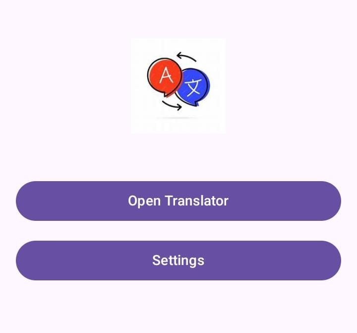
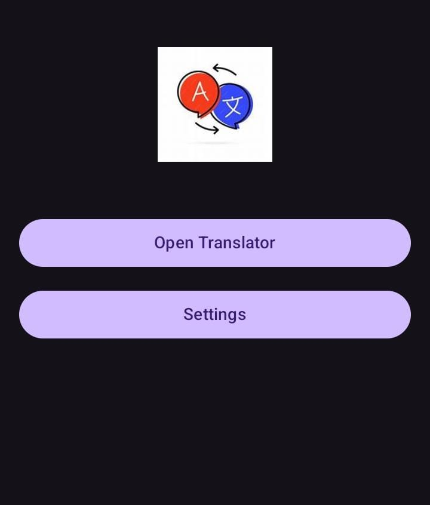
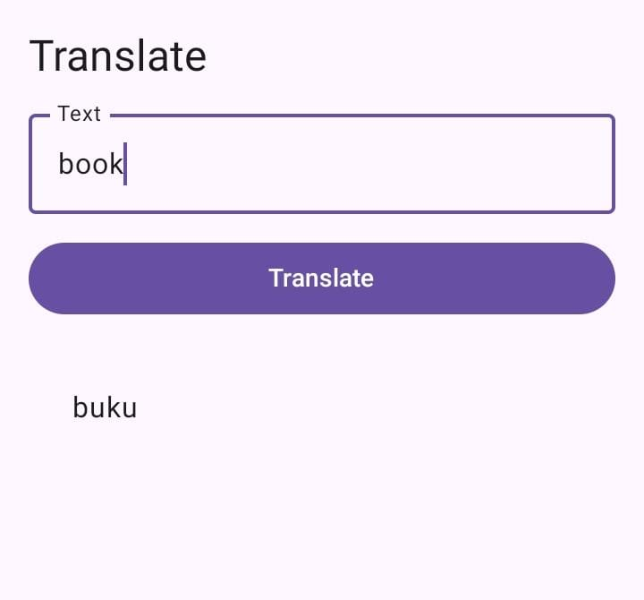
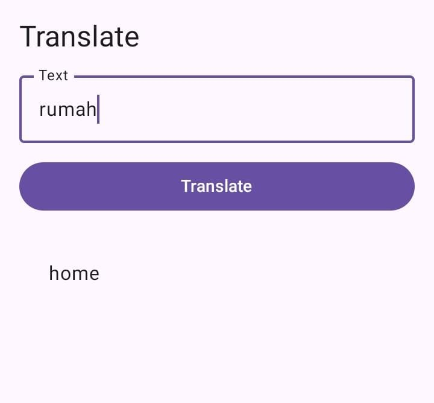
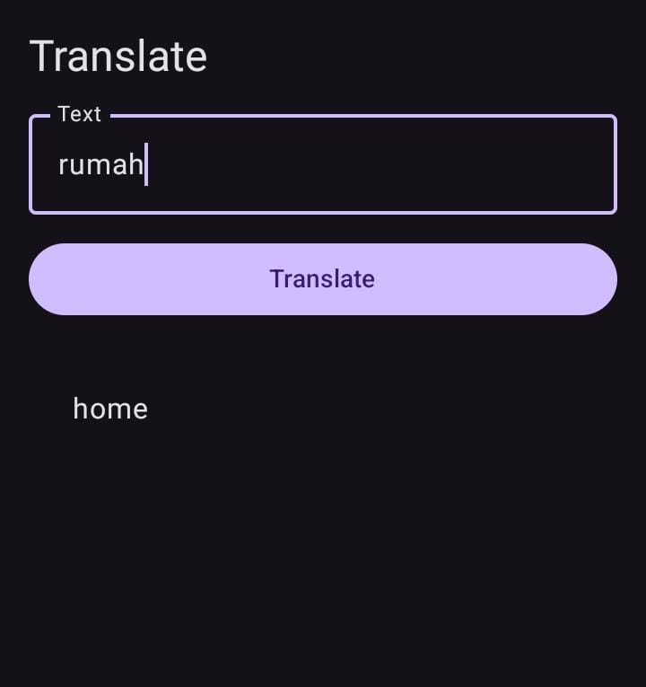
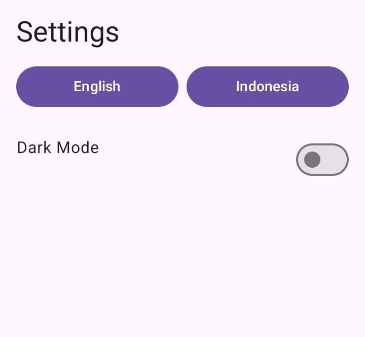
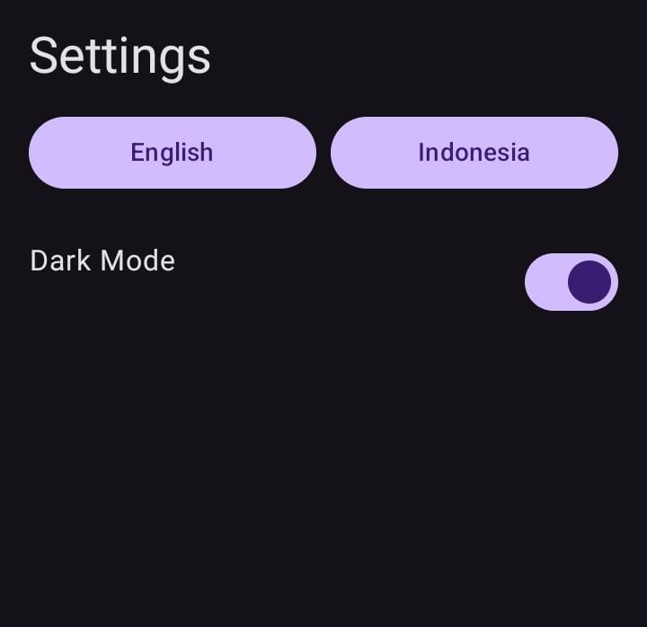

# 🌐 Aplikasi Penerjemah & Pengaturan Tampilan  
Aplikasi ini menyediakan fitur penerjemah teks serta mode tampilan terang dan gelap. Dibuat dengan antarmuka yang sederhana, mudah digunakan, serta mendukung pengalaman pengguna yang modern.

---

## 📌 Fitur Utama

### ⭐ 1. Halaman Utama
Menampilkan navigasi utama aplikasi serta akses cepat ke fitur-fitur utama.

**Tampilan Terang**  


**Tampilan Gelap**  


---

### ⭐ 2. Fitur Penerjemah
Fitur utama untuk menerjemahkan teks antar bahasa, mendukung mode terang dan gelap.

**Tampilan Terang**  
  


**Tampilan Gelap**  
  


---

### ⭐ 3. Pengaturan Aplikasi
Mengatur preferensi tampilan seperti Light Mode dan Dark Mode.

**Tampilan Terang**  


**Tampilan Gelap**  


---

## 🛠️ Instalasi & Cara Menjalankan

1. **Clone repository**
   ```bash
   git clone https://github.com/username/nama-project.git
